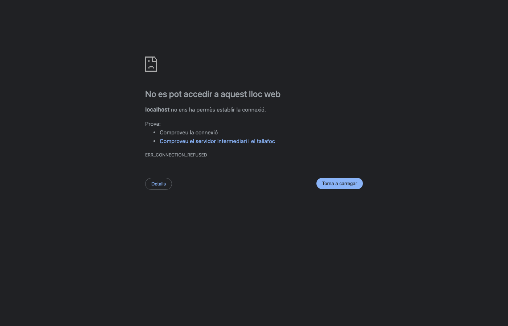

# Assets Converter

Convertidor d'arxius de recursos locals pel desenvolupament de projectes web: imatges a WebP, optimització SVG i fonts a WOFF2.

Aquest projecte és una pràctica d'aprenentatge, no pretén ser una aplicació comercial. Qualsevol persona en pot fer ús sense cap limitació.

- [Objectiu](#objectiu)
- [Tecnologies](#tecnologies)
- [Requisits](#requisits)
- [Dependències](#dependències)
- [Ús](#ús)
- [Plataformes](#plataformes)
- [Eines](#eines)
- [Comportament de sobreescriptura](#comportament-de-sobreescriptura)
- [Agraïments](#agraïments)

---

---



## Objectiu

Assets Converter és una eina local que optimitza els recursos d'un projecte web sense necessitat de pujar arxius a cap servidor extern. Selecciones una carpeta, tries el tipus de conversió i els arxius optimitzats es guarden al directori de sortida. Els originals no es modifiquen mai.

## Tecnologies

| Capa | Tecnologia |
|---|---|
| Servidor | [Astro](https://astro.build) + adaptador Node.js |
| Bundler | [Vite](https://vite.dev) (integrat a Astro) |
| Gestor de paquets | [pnpm](https://pnpm.io) |
| Llenguatge | TypeScript |
| UI | HTML + CSS + JavaScript (sense framework) |
| Progrés en temps real | SSE (Server-Sent Events) |

## Requisits

- Node.js >= 22
- pnpm >= 9

## Dependències

| Paquet | Ús |
|---|---|
| `sharp` | Imatges → WebP |
| `svgo` | SVG → SVG optimitzat |
| `wawoff2` | TTF → WOFF2 |
| `opentype.js` | OTF / WOFF → TTF |

## Ús

### Desenvolupament

```bash
pnpm install
pnpm dev
```

Obre http://localhost:9999 al navegador. El mode `dev` s'executa ràpid i es recarrega automàticament en modificar el codi.

### Producció

```bash
pnpm build
node dist/server/entry.mjs
```

## Plataformes

macOS, Linux, Windows.

## Eines

| Eina | Funció | Entrada | Sortida |
|---|---|---|---|
| Imatges | Converteix a WebP | `.jpg` `.jpeg` `.png` | `.webp` |
| Vectors | Optimitza SVG | `.svg` | `.svg` |
| Fonts | Converteix a WOFF2 | `.ttf` `.otf` `.woff` | `.woff2` |

### Imatges → WebP

Converteix imatges JPEG i PNG al format **WebP**, que redueix considerablement la mida dels arxius sense pèrdua de qualitat visible. És el format recomanat per a la web perquè millora el temps de càrrega de les pàgines. La compressió depèn del contingut de cada imatge: fotografies, logotips i gràfics obtenen resultats diferents.

Paràmetres: qualitat (0-100), velocitat (0-6) i mode sense pèrdua.

### Vectors → SVG optimitzat

Neteja i optimitza arxius **SVG** eliminant metadades, comentaris, atributs innecessaris i espais en blanc. El resultat és un SVG més petit i net, sense canvis visuals.

Paràmetres: precisió decimal (0-10).

### Fonts → WOFF2

Converteix fonts **TTF**, **OTF** i **WOFF** al format **WOFF2**, el format de fonts comprimit estàndard per a la web. WOFF2 fa servir compressió Brotli i redueix la mida de les fonts fins a un 50 % respecte del WOFF original.

## Comportament de sobreescriptura

Si no se sobreescriu i l'arxiu de sortida ja existeix, s'afegeix un sufix `_001`, `_002`...

## Agraïments

A <a href="https://www.stucom.com" target="_blank" rel="noopener">STUCOM</a> i a la <a href="https://www.fib.upc.edu" target="_blank" rel="noopener">FIB — Facultat d'Informàtica de Barcelona</a> per formar la comunitat dev catalana.

---

Fet amb ❤️ des de Catalunya
